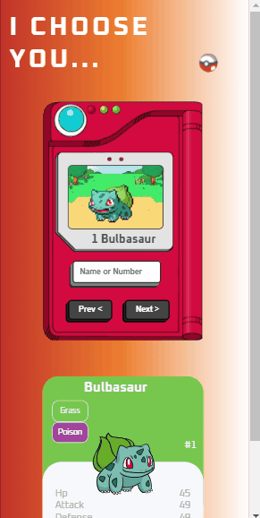
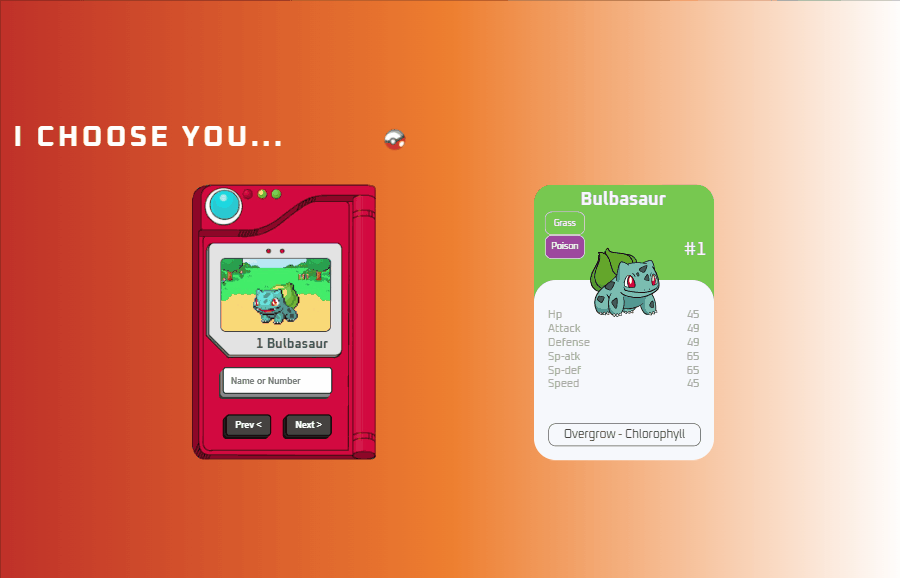

# Poke-API

### Veja como ficou o projeto em diferentes tamanhos de tela:

## Móbile:
  

 ## Desktop:
   
 

## Do que se trata esse projeto?
Este projeto trata-se de uma página interativa onde é possível pesquisar pokémons através do seu nome ou seu número.
Essa busca dinâmica é possível através de uma requisição feita a api pública [POKE API](https://pokeapi.co/).

## Quais interações são realizadas?
- O usuário pode pesquisar através do nome ou número do pokémon desejado.
- Também pode navegar entre os botões prev e next , onde irão surgindo os pokémons em sua ordem.
- Além do nome e número do pokémon, também são mostrados qual seu tipo,suas habilidades e suas estatísticas.
  
## Habilidades desenvolvidas:
- Uso de flexbox para ajustes dos elementos na tela.
- Uso de Keyframes para animação da pokébola.
- Uso e manipulação dos elementos no JavaScript,incluindo interpolação de strings.
- Uso do método fetch para realizar a requisição à API.
- Uso de funções assíncronas, eventos, condicionais.
- Uso do método map para manipulação de objetos.
- Uso de mediaqueries para responsividade.

## Linguagens Utilizadas:
- HTML 

- CSS  

- JAVASCRIPT  
          

Para ver o projeto pronto, [CLIQUE AQUI!]()
